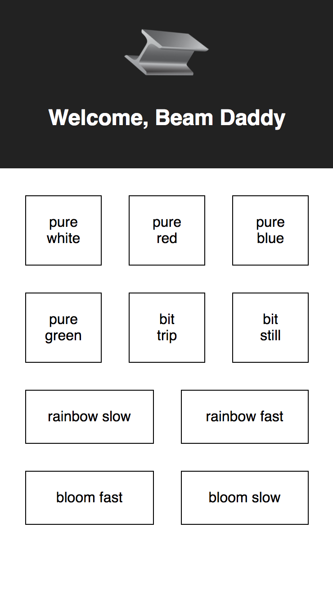

# beam
Arduino-powered light fixture for my living room

On the back-end, I have a main loop that acts as a router for bibliopixel animations. The bibliopixel animation router operates in the main thread, while a flask API runs in a secondary thread on the same process. Then I have a react front-end to push state changes to the flask app, which modifies some globals that are used by the bibliopixel router in the main loop to set the state of the LED matrix. The whole point is to create a lighting fixture in my living room that is made up of a matrix of two WS281X strips (and controllable with my phone).

A version of this project won the "Mad Scientist" award at a Cratejoy Hackathon event in July 2017.

Here's what the react app looks like:

